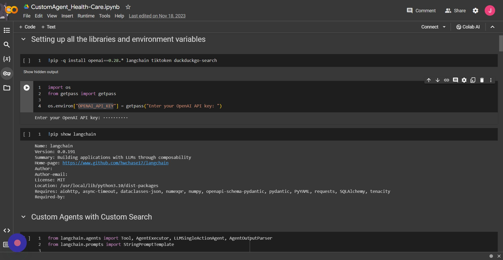
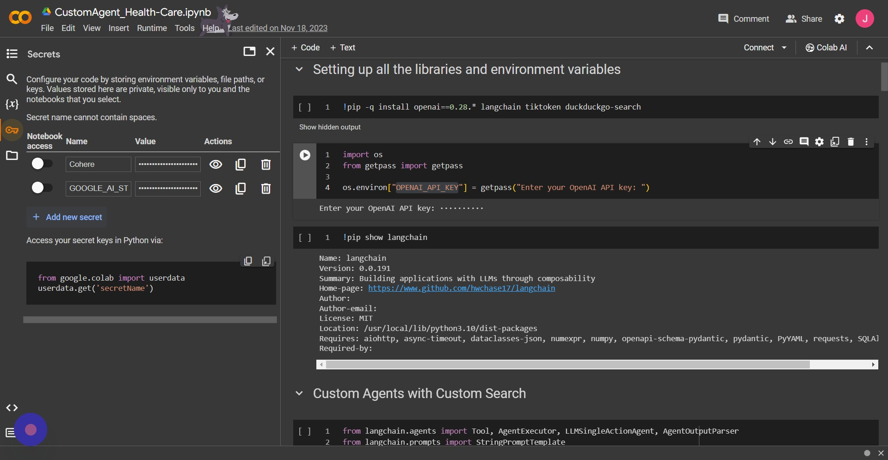
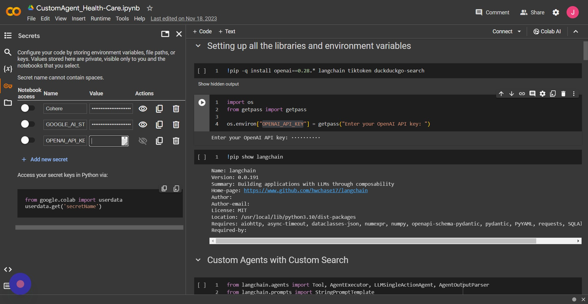
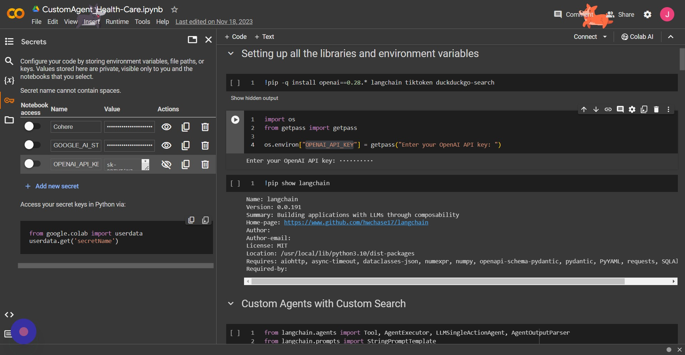

# Lección 2: Security and setting all the environment in google colab

## Indice

- [Instalando Colaboratory desde GoogleApps](./l2.1-InstallingColaboratoryfromGoogleAppsMarketplace.pdf)
- [Creando un nuevo Notebook](./l2.2-CreateNewColabNotebookinGoogleDrive.pdf)
- [Configuraciones inciales y de seguridad para tus api keys](#configuraciones-inciales-y-de-seguridad-para-tus-api-keys)
  - [Instalacion del framework](#instalacion-de-la-libreria)
  - [1er metodo de seguridad de api key](#1er-metodo-para-asegurar-tu-api-key)
  - [2do metodo de seguridad de api key](#2do-metodo-para-asegurar-tu-api-key)

## Configuraciones inciales y de seguridad para tus api keys

### Instalacion de la libreria

```bash
pip install -qU openai langchain
```

### 1er metodo para asegurar tu api key

```python
import os
from getpass import getpass

os.environ["OPENAI_API_KEY"] = getpass("Enter your OpenAI API key: ")
```

`Output`:

```text
Enter your OpenAI API key: ··········
```

### 2do metodo para asegurar tu api key

- primero salvamos el api key en tu cuenta de google

**1. Click en el icono "key" cuando tienes abierto un notebook(este paso solo se necesita hacer una vez)**



**2. Click "Add new secret" para añadir una api key y añade tu nombre de la con la que lo vas a llamar en "Name"**



**3. Click en el campo "Value" para pegar tu clave secreta**



**4. Click en el "Notebook access" para dar accesso a la clave para usar en tu notebook**



**5. Uso**

Su uso en este caso es sencillo

```python
from google.colab import userdata
userdata.get('OPENAI_API_KEY')
```