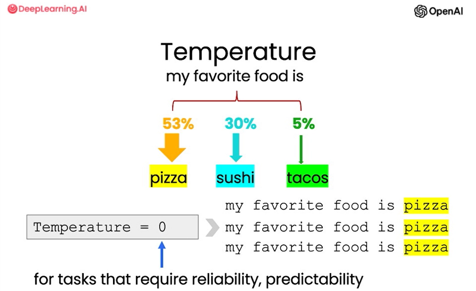
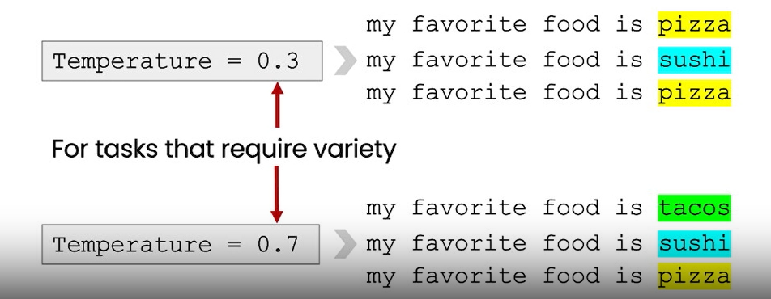

# Lección 3: Modelos de lenguaje (LLMs)

## Definicion

Modelo de lenguaje grande (Large Language Model - LLM): Los LLM son modelos pre-entrenados con una técnica llamada aprendizaje automático, capaces de analizar miles de millones de corpus de texto para aprender patrones de lenguaje, gramática y contexto. Estos modelos son capaces de realizar tareas relacionadas con el lenguaje, como traducción, creación de contenido, resumen y conversación, con una precisión y fluidez muy similar a la de un ser humano. Los LLM funcionan como una gran red neuronal que aprende del contexto, de los propios contenidos y a partir del análisis de secuencias de palabras. Al hacerlo a gran escala con miles de millones de parámetros, permiten desbloquear la capacidad de que la IA sea capaz de generar contenidos similares a los que haría una persona.

## Dos tipos de LLM

- LLM Base: predice las siguientes palabras basándose en datos de entrenamiento de texto (una gran cantidad de datos de texto de Internet y otras fuentes) para determinar la palabra más probable a seguir.
  - Ejemplo: `¿Cuál es la capital de Francia?`
    - ¿Cuál es la ciudad más grande de Francia?
    - ¿Cuál es la población de Francia?
    - ¿Cuál es la moneda de Francia?
- LLM Afinado por Instrucciones:
  - Intenta seguir instrucciones.
  - Afinamiento en instrucciones (entradas/salidas) y buenos intentos de seguir esas instrucciones.
  - Utiliza la técnica de Aprendizaje Reforzado con Retroalimentación Humana (RLHF).
  - Entrenado para ser: Útil, Honesto, Inofensivo, Seguro*

    - Ejemplo: `¿Cuál es la capital de Francia?`
      - La capital de Francia es París.

### ¿Ajuste de las respuestas del modelo?

- El uso del parámetro `Temperature` te permite variar el grado de exploración y la variedad de las respuestas del modelo

Temperature = `0`
- para tareas que requieren confiabilidad, previsibilidad 

Temperature = `0.3 - 0.7`
- Para tareas que requieren variedad

- Configuramos la temperature en `0,7`, lo que cambiará la variedad/aleatoriedad de las respuestas del modelo.

## Punto de vista de langchain

LangChain ofrece una variedad de modelos de inteligencia artificial (IA) para diferentes tipos de tareas. Algunos puntos clave a considerar son:

• Introducción a los diferentes tipos de modelos y su integración en LangChain:

LangChain ofrece diferentes tipos de modelos, como LLM (Language Learning Model), Chat Model, Text Embedding Model, etc.
Estos modelos se pueden integrar en aplicaciones y sistemas utilizando las bibliotecas y wrappers proporcionados por LangChain.

Todos los LLM implementan la interfaz Runnable, la cual viene con implementaciones por defecto de todos los métodos, es decir, ainvoke, batch, abatch, stream, astream. Esto les da a todos los LLM un soporte básico para asincronía, streaming y batch, que por defecto se implementa de la siguiente manera:

El soporte asíncrono se configura por defecto para llamar al método síncrono respectivo en el executor de la pool of threads por defecto de asyncio. Esto permite a otras funciones asíncronas en su aplicación avanzar mientras se ejecuta el LLM, al mover esta llamada a un hilo en segundo plano. El soporte de streaming se configura por defecto para devolver un Iterador (o AsyncIterator en el caso de streaming asíncrono) de un solo valor, el resultado final devuelto por el proveedor subyacente de LLM. Esto, obviamente, no le brinda una streaming token por token, lo cual requiere soporte nativo del proveedor de LLM, pero garantiza que su código que espera un iterador de tokens pueda funcionar para cualquiera de nuestras integraciones LLM. El soporte por batch se configura por defecto para llamar al LLM subyacente en paralelo para cada entrada haciendo uso de un executor de la piscina de hilos (en el caso de batch síncronos) o asyncio.gather (en el caso de batch asíncronos). La concurrencia se puede controlar con la clave max_concurrency en RunnableConfig. Cada integración de LLM puede proporcionar opcionalmente implementaciones nativas para asincronía, streaming o batch, que, para los proveedores que lo admiten, pueden ser más eficientes. La tabla muestra, para cada integración, qué características se han implementado con soporte nativo.

| Model | Invoke | Async invoke | Stream | Async stream | Batch | Async batch |
| :-- | :-: | :-: | :-: | :-: | :-: | :-: |
| AI21 | ✅ | ❌ | ❌ | ❌ | ❌ | ❌ |
| AlephAlpha | ✅ | ❌ | ❌ | ❌ | ❌ | ❌ |
| AmazonAPIGateway | ✅ | ❌ | ❌ | ❌ | ❌ | ❌ |
| Anthropic | ✅ | ✅ | ✅ | ✅ | ❌ | ❌ |
| Anyscale | ✅ | ✅ | ✅ | ✅ | ✅ | ✅ |
| Arcee | ✅ | ❌ | ❌ | ❌ | ❌ | ❌ |
| Aviary | ✅ | ❌ | ❌ | ❌ | ❌ | ❌ |
| AzureMLOnlineEndpoint | ✅ | ❌ | ❌ | ❌ | ❌ | ❌ |
| AzureOpenAI | ✅ | ✅ | ✅ | ✅ | ✅ | ✅ |
| Banana | ✅ | ❌ | ❌ | ❌ | ❌ | ❌ |
| Baseten | ✅ | ❌ | ❌ | ❌ | ❌ | ❌ |
| Beam | ✅ | ❌ | ❌ | ❌ | ❌ | ❌ |
| Bedrock | ✅ | ❌ | ✅ | ❌ | ❌ | ❌ |
| CTransformers | ✅ | ✅ | ❌ | ❌ | ❌ | ❌ |
| CTranslate2 | ✅ | ❌ | ❌ | ❌ | ✅ | ❌ |
| CerebriumAI | ✅ | ❌ | ❌ | ❌ | ❌ | ❌ |
| ChatGLM | ✅ | ❌ | ❌ | ❌ | ❌ | ❌ |
| Clarifai | ✅ | ❌ | ❌ | ❌ | ❌ | ❌ |
| Cohere | ✅ | ✅ | ❌ | ❌ | ❌ | ❌ |
| Databricks | ✅ | ❌ | ❌ | ❌ | ❌ | ❌ |
| DeepInfra | ✅ | ✅ | ✅ | ✅ | ❌ | ❌ |
| DeepSparse | ✅ | ✅ | ✅ | ✅ | ❌ | ❌ |
| EdenAI | ✅ | ✅ | ❌ | ❌ | ❌ | ❌ |
| Fireworks | ✅ | ✅ | ✅ | ✅ | ✅ | ✅ |
| ForefrontAI | ✅ | ❌ | ❌ | ❌ | ❌ | ❌ |
| GPT4All | ✅ | ❌ | ❌ | ❌ | ❌ | ❌ |
| GigaChat | ✅ | ✅ | ✅ | ✅ | ✅ | ✅ |
| GooglePalm | ✅ | ❌ | ✅ | ❌ | ✅ | ❌ |
| GooseAI | ✅ | ❌ | ❌ | ❌ | ❌ | ❌ |
| GradientLLM | ✅ | ✅ | ❌ | ❌ | ✅ | ✅ |
| HuggingFaceEndpoint | ✅ | ❌ | ❌ | ❌ | ❌ | ❌ |
| HuggingFaceHub | ✅ | ❌ | ❌ | ❌ | ❌ | ❌ |
| HuggingFacePipeline | ✅ | ❌ | ❌ | ❌ | ✅ | ❌ |
| HuggingFaceTextGenInference | ✅ | ✅ | ✅ | ✅ | ❌ | ❌ |
| HumanInputLLM | ✅ | ❌ | ❌ | ❌ | ❌ | ❌ |
| JavelinAIGateway | ✅ | ✅ | ❌ | ❌ | ❌ | ❌ |
| KoboldApiLLM | ✅ | ❌ | ❌ | ❌ | ❌ | ❌ |
| LlamaCpp | ✅ | ❌ | ✅ | ❌ | ❌ | ❌ |
| ManifestWrapper | ✅ | ❌ | ❌ | ❌ | ❌ | ❌ |
| Minimax | ✅ | ❌ | ❌ | ❌ | ❌ | ❌ |
| MlflowAIGateway | ✅ | ❌ | ❌ | ❌ | ❌ | ❌ |
| Modal | ✅ | ❌ | ❌ | ❌ | ❌ | ❌ |
| MosaicML | ✅ | ❌ | ❌ | ❌ | ❌ | ❌ |
| NIBittensorLLM | ✅ | ❌ | ❌ | ❌ | ❌ | ❌ |
| NLPCloud | ✅ | ❌ | ❌ | ❌ | ❌ | ❌ |
| Nebula | ✅ | ❌ | ❌ | ❌ | ❌ | ❌ |
| OctoAIEndpoint | ✅ | ❌ | ❌ | ❌ | ❌ | ❌ |
| Ollama | ✅ | ❌ | ❌ | ❌ | ❌ | ❌ |
| OpaquePrompts | ✅ | ❌ | ❌ | ❌ | ❌ | ❌ |
| OpenAI | ✅ | ✅ | ✅ | ✅ | ✅ | ✅ |
| OpenLLM | ✅ | ✅ | ❌ | ❌ | ❌ | ❌ |
| OpenLM | ✅ | ✅ | ✅ | ✅ | ✅ | ✅ |
| PaiEasEndpoint | ✅ | ❌ | ✅ | ❌ | ❌ | ❌ |
| Petals | ✅ | ❌ | ❌ | ❌ | ❌ | ❌ |
| PipelineAI | ✅ | ❌ | ❌ | ❌ | ❌ | ❌ |
| Predibase | ✅ | ❌ | ❌ | ❌ | ❌ | ❌ |
| PredictionGuard | ✅ | ❌ | ❌ | ❌ | ❌ | ❌ |
| PromptLayerOpenAI | ✅ | ❌ | ❌ | ❌ | ❌ | ❌ |
| QianfanLLMEndpoint | ✅ | ✅ | ✅ | ✅ | ❌ | ❌ |
| RWKV | ✅ | ❌ | ❌ | ❌ | ❌ | ❌ |
| Replicate | ✅ | ❌ | ✅ | ❌ | ❌ | ❌ |
| SagemakerEndpoint | ✅ | ❌ | ❌ | ❌ | ❌ | ❌ |
| SelfHostedHuggingFaceLLM | ✅ | ❌ | ❌ | ❌ | ❌ | ❌ |
| SelfHostedPipeline | ✅ | ❌ | ❌ | ❌ | ❌ | ❌ |
| StochasticAI | ✅ | ❌ | ❌ | ❌ | ❌ | ❌ |
| TextGen | ✅ | ❌ | ❌ | ❌ | ❌ | ❌ |
| TitanTakeoff | ✅ | ❌ | ✅ | ❌ | ❌ | ❌ |
| TitanTakeoffPro | ✅ | ❌ | ✅ | ❌ | ❌ | ❌ |
| Tongyi | ✅ | ✅ | ✅ | ✅ | ✅ | ✅ |
| VLLM | ✅ | ❌ | ❌ | ❌ | ✅ | ❌ |
| VLLMOpenAI | ✅ | ✅ | ✅ | ✅ | ✅ | ✅ |
| VertexAI | ✅ | ✅ | ✅ | ❌ | ✅ | ✅ |
| VertexAIModelGarden | ✅ | ✅ | ❌ | ❌ | ✅ | ✅ |
| VolcEngineMaasLLM | ✅ | ❌ | ✅ | ❌ | ❌ | ❌ |
| WatsonxLLM | ✅ | ❌ | ✅ | ❌ | ✅ | ❌ |
| Writer | ✅ | ❌ | ❌ | ❌ | ❌ | ❌ |
| Xinference | ✅ | ❌ | ❌ | ❌ | ❌ | ❌ |
| YandexGPT | ✅ | ✅ | ❌ | ❌ | ❌ | ❌ |

• Uso básico del modelo de OpenAI Instruct Model:

El modelo de OpenAI Instruct se utiliza para generar instrucciones y respuestas detalladas a preguntas.
Se puede utilizar proporcionando una plantilla de pregunta y respuesta, y luego ejecutando el modelo con una pregunta específica.
Por ejemplo, se puede utilizar para responder preguntas como "¿Cuál fue el equipo de la NFL que ganó el Super Bowl en el año en que nació Justin Bieber?".

• Uso básico del modelo de ChatOpenAI:

El modelo de ChatOpenAI se utiliza para crear chatbots y sistemas de conversación basados en IA.
Se puede utilizar proporcionando una plantilla de conversación y luego interactuando con el modelo enviando mensajes.
Por ejemplo, se puede utilizar para simular una conversación con un chatbot respondiendo preguntas o proporcionando información.

En resumen, LangChain ofrece una variedad de modelos de IA para diferentes tareas, como procesamiento de lenguaje natural y chatbots. Estos modelos se pueden integrar en aplicaciones y sistemas utilizando las bibliotecas y wrappers proporcionados por LangChain. El modelo de OpenAI Instruct se utiliza para generar instrucciones detalladas, mientras que el modelo de ChatOpenAI se utiliza para crear chatbots y sistemas de conversación basados en IA.

## Notebook : 

Consulta el siguiente [notebook](./lab/l3-models.ipynb) para ver las soluciones

## Referencias

Curso Principal : 
- https://learn.deeplearning.ai/chatgpt-prompt-eng/lesson/3/iterative

Langchain framework :
- https://python.langchain.com/docs/modules/model_io/llms/
- https://python.langchain.com/docs/integrations/llms/
- https://python.langchain.com/docs/integrations/chat/openai

Fuentes usadas :
- https://www.bbva.com/es/innovacion/los-llm-modelos-de-lenguaje-que-son-y-como-funcionan/
- https://es.wikipedia.org/wiki/LLM_(modelo_grande_de_lenguaje)