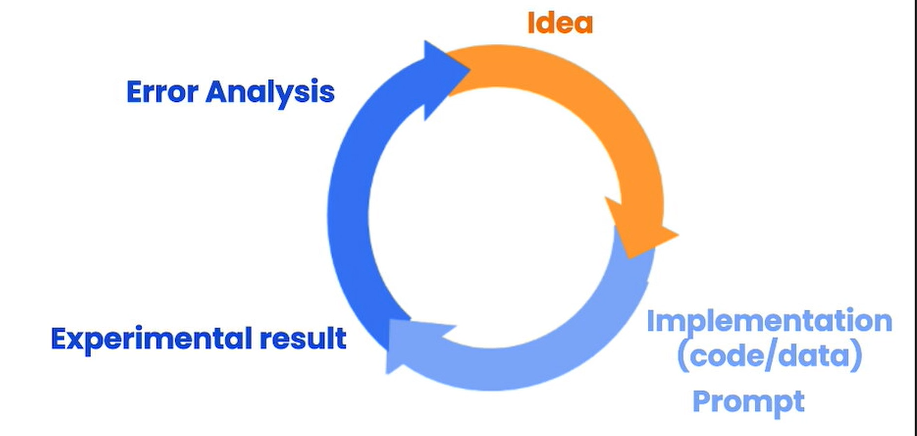
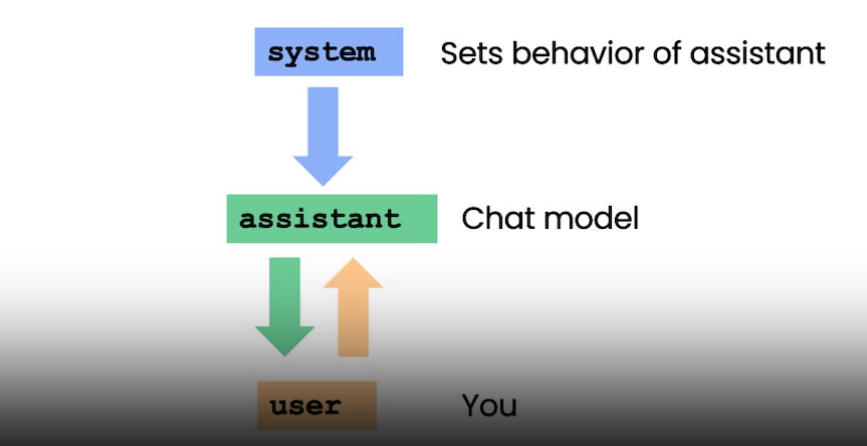

# Lesson4: Prompts

## Definicion: 

Los prompts son conjuntos de instrucciones o entradas proporcionadas por un usuario para guiar la respuesta de un modelo de lenguaje. Ayudan al modelo a comprender el contexto y generar una salida relevante y coherente basada en el lenguaje, como responder preguntas, completar frases o participar en una conversación. Los prompts pueden ser plantillas parametrizadas, ejemplos seleccionados dinámicamente o incluso mensajes de chat. Se pueden utilizar en una variedad de casos de uso, como la generación de respuestas, la traducción automática o la redacción de textos.

## Tips y Trucos

Las 6 estrategias de ingeniería de prompts para obtener los mejores resultados de los Modelos de Lenguaje Grande (LLM):

1. Escribir instrucciones claras.
2. Proporcionar texto de referencia.
3. Dividir tareas complejas en subtareas más simples.
4. Dar tiempo al modelo para "pensar".
5. Utilizar herramientas externas.
6. Probar cambios sistemáticamente.

## Proceso de Desarrollo Iterativo de prompts

## Acercamiento por parte de Langchain

Los prompts son conjuntos de instrucciones o entradas proporcionadas a un modelo de lenguaje para guiar su respuesta y generar una salida basada en el lenguaje relevante y coherente. Langchain proporciona varias herramientas y funcionalidades para trabajar con prompts. Aquí se explica detalladamente lo que son los prompts junto con ejemplos:

• Plantillas de prompts: Langchain ofrece plantillas de prompts, que son entradas de modelo parametrizadas. Estas plantillas te permiten definir marcadores de posición en el texto de entrada que pueden completarse con valores específicos durante el tiempo de ejecución. Por ejemplo, puedes crear una plantilla como "Traducir la oración: {oración}" y proporcionar el valor para el marcador de posición {oración} al usar la plantilla.

• Selectores de ejemplos: Langchain también proporciona selectores de ejemplos, que te permiten seleccionar dinámicamente ejemplos para incluir en las prompts. Esto puede ser útil para escenarios de aprendizaje con pocos ejemplos, donde deseas proporcionar al modelo un pequeño número de ejemplos para que aprenda. Los selectores de ejemplos te ayudan a elegir los ejemplos más relevantes según criterios específicos. Aquí tienes algunos ejemplos de cómo se pueden usar las prompts: 

• Ejemplo de plantilla de indicación: 
• Plantilla: "Traducir la oración: {oración}" 
• Entrada: "Traducir la oración: Hello, how are you?" 
• Salida: "Bonjour, comment ça va?" (traducción al francés) 

• Ejemplo de selector de ejemplos: 
• Selector: Elegir ejemplos con sentimiento positivo 
• Ejemplos: 
• "¡Me encanta este producto! ¡Es increíble." 
• "El clima está hermoso hoy." 
• "Me la pasé genial en la fiesta." 

• Ejemplo seleccionado: "¡Me encanta este producto! ¡Es increíble."

## Prompts para modelos de chat

Consta de los siguientes componentes:

- El mensaje del `system` es una instrucción de alto nivel que establece el comportamiento del asistente. 
- El mensaje del `user` da instrucciones al usuario.
- El `Assistant` es la finalización del modelo.

## Ejemplo para practicar: 

Consulta el siguiente [notebook](./lab/l4-prompts.ipynb) para ver ejemplos y las soluciones

## References

Main course : 
- https://learn.deeplearning.ai/chatgpt-prompt-eng/lesson/4/summarizing