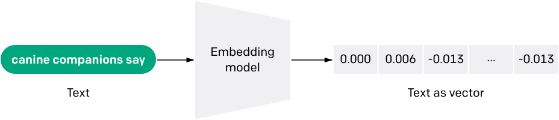
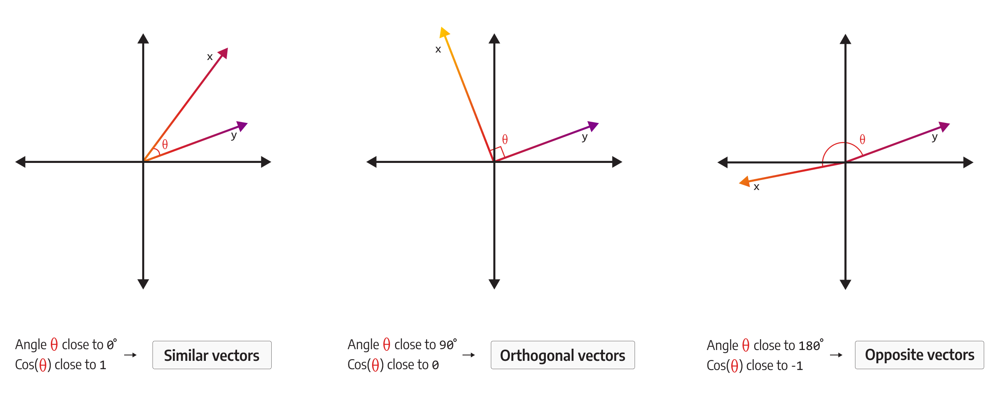
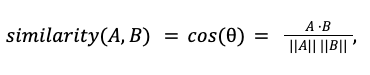
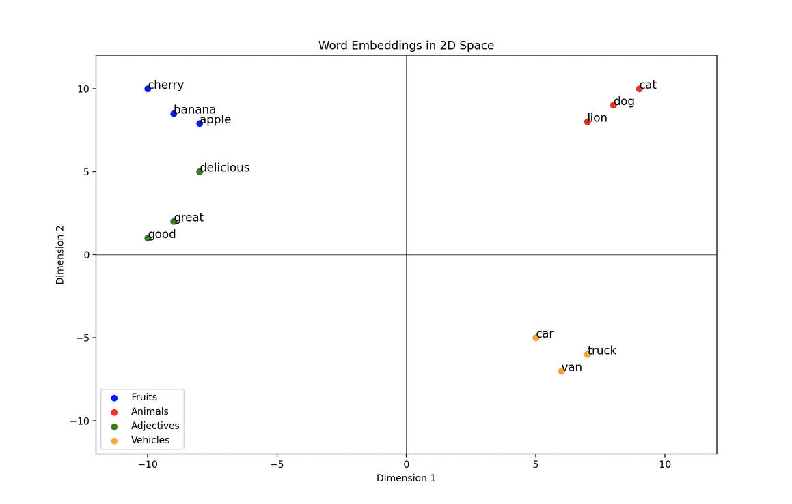

# Lección 7: Embeddings y Vectorstores

## Embeddings

### Resumen

Los Embeddings de Langchain son modelos de embedding de texto que permiten representar palabras, frases o documentos en un espacio vectorial. Estos modelos capturan el significado semántico y la similitud entre diferentes textos. Los Embeddings de Langchain son wrappers alrededor de modelos de embedding de diferentes APIs y servicios, como OpenAI, HuggingFace, Google Cloud VertexAI, entre otros. Estos modelos pueden ser LLMs (Large Language Models) o no. Proporcionan una interfaz para realizar búsquedas y consultas de texto, y devuelven vectores de embedding que representan el contenido de los textos

### Casos de Uso:

Los Embeddings de Langchain tienen una amplia variedad de casos de uso en el procesamiento de lenguaje natural y la recuperación de información. Algunos ejemplos de casos de uso son:

- Búsqueda semántica: Los Embeddings permiten buscar documentos o frases similares en función de su significado semántico, en lugar de simplemente buscar coincidencias exactas de palabras clave.
- Clasificación de texto: Los Embeddings se pueden utilizar para clasificar automáticamente textos en categorías o etiquetas predefinidas, como análisis de sentimientos, detección de spam o clasificación de noticias.
- Recomendación de contenido: Los Embeddings pueden ayudar a recomendar contenido relevante a los usuarios en función de sus preferencias y comportamiento anterior.
- Análisis de similitud de texto: Los Embeddings permiten medir la similitud entre diferentes textos, lo que puede ser útil en tareas como la detección de plagio, la agrupación de documentos o la recuperación de información.

Estos son solo algunos ejemplos de casos de uso de los Embeddings de Langchain. Su versatilidad y capacidad para capturar el significado semántico del texto los hacen útiles en una amplia gama de aplicaciones de procesamiento de lenguaje natural.

### Algoritmo de similitud del coseno: inmersión profunda

La similitud coseno es una medida de similitud entre dos vectores no nulos de un espacio de producto interno basada en el coseno del ángulo entre ellos, dando como resultado un valor entre -1 y 1. El valor -1 significa que los vectores son opuestos, 0 representa vectores ortogonales, y el valor 1 significa vectores similares.

Para calcular la similitud coseno entre los vectores A y B, puedes utilizar la siguiente fórmula:

La similitud coseno se usa a menudo en análisis de texto para comparar documentos y determinar su similitud y su grado. En ese caso, los documentos deben ser representados como un vector, donde cada palabra única es una dimensión y la frecuencia o peso de esa palabra única en el documento representa el valor de esa dimensión específica. Después de la transformación de documentos a vectores, la comparación utilizando la similitud coseno es relativamente sencilla: medimos el coseno del ángulo entre sus vectores. Si el ángulo entre los vectores (documentos) es pequeño, entonces el coseno del ángulo es alto y, por lo tanto, los documentos son similares. Por el contrario, si el ángulo entre los vectores (documentos) es grande, entonces el coseno del ángulo es bajo, lo que resulta en documentos opuestos (no similares). La similitud coseno considera la orientación de los vectores, pero no tiene en cuenta sus magnitudes. En el ejemplo anterior, esto significa que incluso documentos de longitudes totalmente diferentes pueden considerarse similares si están relacionados con el mismo tema.

> La interpretación intuitiva y versatilidad del algoritmo de similitud coseno han encontrado su camino en diversas aplicaciones, que van desde análisis de texto y sistemas de recomendación hasta bases de datos de grafos complejos. La capacidad del algoritmo para capturar la orientación de los vectores lo convierte en una medida robusta de similitud, especialmente en espacios de alta dimensión.

### Ejemplo

## Vectorstores

### Resumen:

Los Vector stores de Langchain son bases de datos especializadas en el almacenamiento y búsqueda de datos no estructurados mediante la técnica de embedding.

### Opciones:

Los Vector stores de Langchain son bases de datos especializadas en el almacenamiento y búsqueda de datos no estructurados mediante la técnica de embedding. Estos stores almacenan los datos en forma de vectores de embedding y permiten realizar búsquedas de vectores similares a un vector de consulta. Algunas opciones de Vector stores disponibles en Langchain son:

- Chroma: Una base de datos vectorial que se ejecuta en tu máquina local como una biblioteca.
- FAISS: Una base de datos vectorial que utiliza la biblioteca Facebook AI Similarity Search (FAISS).
- LanceDB: Una base de datos vectorial basada en el formato de datos Lance.

Estos Vector stores son gratuitos, de código abierto y se ejecutan completamente en tu máquina local.

### Casos de Uso:

Los Vector stores de Langchain tienen diversos casos de uso en los que pueden ser aplicados. Algunos ejemplos de casos de uso comunes incluyen:

- Búsqueda de similitud: Los Vector stores permiten buscar vectores similares a un vector de consulta, lo que es útil en aplicaciones como la búsqueda de imágenes similares, recomendaciones de productos o búsqueda de documentos similares.

- Agrupación de datos: Los Vector stores pueden agrupar datos similares en clústeres, lo que es útil para tareas como segmentación de clientes, detección de anomalías o clasificación de documentos.

- Recuperación de información: Los Vector stores pueden almacenar y buscar información no estructurada, como texto o imágenes, lo que es útil para aplicaciones como motores de búsqueda o sistemas de recuperación de información.

- Análisis de datos: Los Vector stores pueden ser utilizados para realizar análisis de datos basados en similitud, como la detección de fraudes, análisis de sentimientos o análisis de contenido.

Estos son solo algunos ejemplos de casos de uso para los Vector stores de Langchain, pero las posibilidades son amplias y dependen de las necesidades específicas de cada proyecto.

## Notebook

Consulta el [notebook](./lab/l7-embeddings.ipynb) para ver los ejemplos de cada una de esas tareas anteriores.

## References

Curso principal : 
- https://learn.deeplearning.ai/chatgpt-prompt-eng/lesson/7/expanding

Langchain Documentacion : 
- https://python.langchain.com/docs/integrations/text_embedding/openai
- https://python.langchain.com/docs/modules/data_connection/vectorstores/